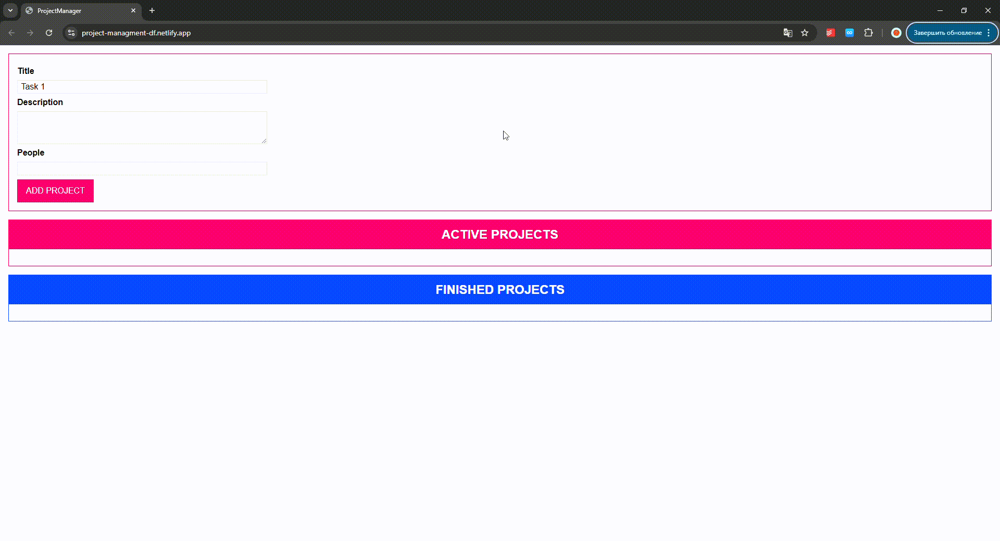

# Drag-And-Drop

## About the Project

This project is a drag-and-drop application implemented using TypeScript, showcasing a simple yet effective way to manage draggable and droppable elements on a web page.

## Purpose of the Project

The primary goals of this project were:

- To master TypeScript for building scalable and type-safe applications.
- To explore drag-and-drop functionality using the DOM API.
- To practice organizing a project with modular code and clean architecture.

## [Live Demo](https://project-managment-df.netlify.app/)

Check out the [live demo](https://project-managment-df.netlify.app/)


## Getting Started

### Installation and Running the Project

Clone the repository:

```
git clone https://github.com/FilonenkoDima/Drag-And-Drop.git
cd Drag-And-Drop
```

Install dependencies:

```
npm install
```

Start the development server:

```
npm start
```

## Project Structure

```
Drag-And-Drop/
├── src/
│ ├── components/ # Contains reusable components
│ ├── decorators/ # Contains reusable decorators
│ ├── models/ # Interfaces and type definitions
│ ├── state/ # Project State Management
│ ├── util/ # Helper functions
│ ├── app.ts # Main application logic
├── dist/ # Compiled output for production
├── index.html # Entry point for the application
├── app.css # Styles
├── tsconfig.json # TypeScript configuration
├── package.json # Project metadata and dependencies
├── webpack.config.js # Webpack settings
```

## Key Features and Architecture

#### Application Workflow

1. Add a new task with a description.
2. Drag tasks between different states (e.g., "In Progress", "Completed").
3. Changes reflect immediately without reloading the page.

## Contribution

Contributions are welcome! Fork the repository, make changes, and submit a pull request.
